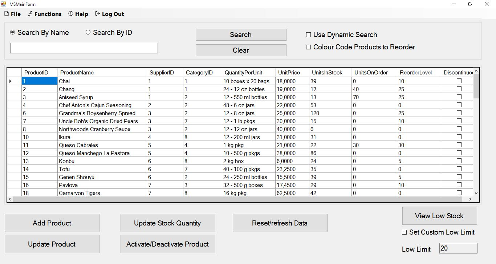

# projectIMSBasicWFA

- Inventory Management using Northwind dataset Products Table
- A basic inventory management system solution

# TOC


# Project Details
- Software Used :
  - Microsoft Visual Studio 2015 community edition 
  - SQL Server 
- Programming Language  
  - Visual C# Programming language

# Project Demonstration/Explanaition


- The Login 

 
- The Main Window where you can view the inventory

 
- The search bar can search by product name or ID, it can also allow dynamic search as you type.

 
- Colour code can be activated at the search bar to show low stock which can be set on the Right lower corner

 
- Form to add a new product

 
- Form to update an existing product


- Form to update an existing products quantity

 
- Form to view Active products and option to deactivate the products

 
- Form to view Inactive products and option to activate the products

# Project Database Connectivity
- Login database, used for login credentials. username: Admin0, password: Password

## The main connection class
- There are many ways to connect to a database.
- For this project we used a custom connectivity class called DBConnect
- This is the class you must modify for the system to work locally on your machine after install SQLServer and create the databases provide in the directory 'databaseInfo'

```C#
using System;
using System.Collections.Generic;
using System.Linq;
using System.Text;
using System.Threading.Tasks;
using System.Data.SqlClient;

namespace projectIMSBasicWFA
{
    class DBConnect
    {
        public string ConnString = "Data Source=[LOCAL_DATABASE_NAME]; Initial Catalog=Northwind; Integrated Security=True";
        public string Sql { get; set; }
        public string SqlWhere { get; set; }
        public  SqlConnection SqlConn { get; set; }
        public SqlCommand Cmd { get; set; }
        public  SqlDataAdapter DA { get; set; }

        public string tableName = "";
        public string searchProperty = "";
        public int searchValue = 0;

        public DBConnect(string tableName)
        {
            Sql = "SELECT * FROM " + tableName;
            SqlConn = new SqlConnection(ConnString);
            Cmd = new SqlCommand(Sql, SqlConn);
            DA = new SqlDataAdapter(Cmd);
            SqlCommandBuilder cmdBuild = new SqlCommandBuilder(DA);
        }

        public DBConnect(string tableName, string sqlWhere)
        {
            Sql = "SELECT * FROM " + tableName + " WHERE " + sqlWhere;
            SqlConn = new SqlConnection(ConnString);
            Cmd = new SqlCommand(Sql, SqlConn);
            DA = new SqlDataAdapter(Cmd);
            SqlCommandBuilder cmdBuild = new SqlCommandBuilder(DA);
        }

        public DBConnect(string tableName, string Database, string sqlWhere)
        {
            Sql = "SELECT * FROM " + Database + ".dbo." + tableName + " WHERE " + sqlWhere;
            SqlConn = new SqlConnection(ConnString);
            Cmd = new SqlCommand(Sql, SqlConn);
            DA = new SqlDataAdapter(Cmd);
            SqlCommandBuilder cmdBuild = new SqlCommandBuilder(DA);
        }

    }

}

```
## The SQLServer Database setup
- Two databases are used
  - Northwind (Free database from microsoft repository)
  - LoginDB
- This was done to keep the Northwind DB as is while allowing for a login option for the system

## The LoginDB database


- The Design of the DB


- The seeding and auto-increment setting


- The data